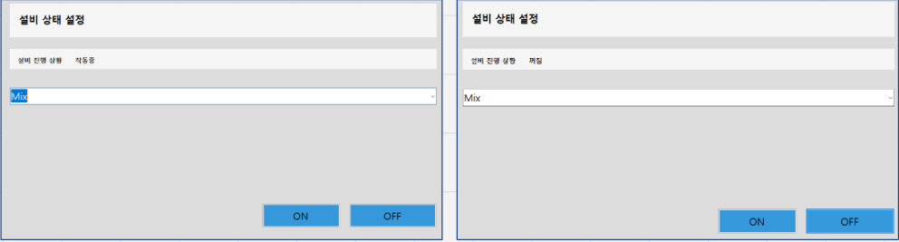
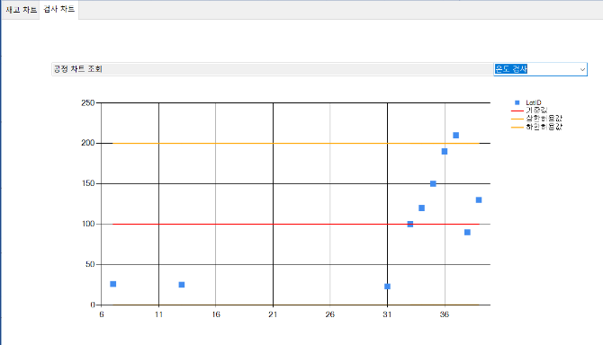

# **라면 공장 스마트팩토리 MES 프로그램**

## **개요**
-소프트웨어, 하드웨어 , 데이터베이스간 실시간 데이터 연동과 PC와 하드웨어간 Serial 통신이 가능한 MES 시스템


## **개발 환경 및 활용 기술**
C#, ASP.NET, Winform, Arduino, Entity FrameWork

## **공헌한 내용**
- 기여도 40%
- 메뉴버튼으로 각 폼간 이동
- Serial Protocol 설계
- 공정을 통과한 LOT 이력 조회기능 구현
- H/W 와 S/W 간의 양방향 Serial 통신 구현
- 공정 상태 (정지/가동) 제어 버튼 기능 구현
- 센서를 이용한 LOT 검사 구현
- 온습도센서, 초음파센서, 수심 측정 센서, LED, 버튼 제어
- 공정이 시작되면 10초 타이머 실행, 공정이 멈추면 타이머 일시정지 기능 구현
- 불량 여부 판별
- Winform 차트를 이용하여 검사 결과 시각화
- 데이터베이스에 검사 결과, 공정 상태 저장
- ATMEGA 2560을 활용한 하드웨어 회로 설계

<br>

### **[제작 시연 영상]**

<br>
<br>

발표자료 PPT


## **프로젝트 설명**

### **공정 구현에 사용된 입출력 장치**

|부품명|사용 개수|사용 목적|
|---|---|---
|DHT11 온습도센서|1| 스팀기의 온도 검사
|Water Level Sensor|1|팜유의 용량 검사
|HC-SR04 초음파 센서|2|입출고시 LOT 개수 검사
|I2C LCD|1|공정 현황 실시간 표시
|LED_RED 빨간색|6|공정 정지시 점등
|LED_GREEN 초록색|6|공정 대기시 점등
|LED_YELLOW 노란색|6|공정 진행시 점등


### **주요 코드 설명**

Serial 통신(UART)을 이용하여 아두이노 보드와 PC 간의 통신하는 코드 
```C#
  public MainForm()
        {
           InitializeComponent();

            //시리얼 포트 생성
            serialPort = new();
            serialPort.BaudRate = 9600;
            serialPort.DataReceived += serialPort_DataReceived;

            serialPort.ReadTimeout = 0;
            lotRepository = new LotRepository();
            lothistoryRepository = new LothistoryRepository();
            processRepository = new ProcessRepository();

            //  mainform이 로드될 때 수행할 작업
            string port = $"com7";

            serialPort.PortName = port;   //시리얼 포트 설정

            // 시리얼 통신 시작
            if (serialPort.IsOpen)
            {
                // 이미 com 포트 오픈 되어 있으면. 아무것도 안함.
                MessageBox.Show($"이미 {port}는 열려 있습니다");
            }
            else
            {
                // 연결이 안되어 있으면 연결한다.
                serialPort.Open();
            }
        }

```
<br>

Serial 통신을 수신하는 코드 , ExecCommand 함수에서 식별자로 구분한다.
```c#
private void serialPort_DataReceived(object sender, SerialDataReceivedEventArgs e)
{
    if (serialPort.IsOpen)
    {
        try
        {
            while (true)
            {
                string input = "";
                string recvData = serialPort.ReadLine().Trim();   // Trim() 꼭 해야 한다 
                input = $"← {recvData}";
                ShowMessage(input); // ListBox 에 출력
                ExecCommand(recvData);
            }
        }
        catch (TimeoutException) { }  // ReadTimeout = 0;  // 읽기 timeout (ms) 을 0 으로 하자.
    }
}
```

<br>

수신 받은 시리얼 문자열 메시지를 ',' 를 기준으로 잘라 순서대로 배열에 저장하여 사용한다. <br>
메시지의 앞부분은 식별자, 두번째는 공정명, 세번째는 lotid, 네번째는 검사 data로 이루어진다.
```c#
private async void ExecCommand(string recvData)
{
    if (recvData.Length == 0 || recvData[0] != '$') return;

    string[] arrMessage = recvData[1..].Split(",", StringSplitOptions.RemoveEmptyEntries);
    if (arrMessage[2].IsNullOrEmpty() || arrMessage[1].IsNullOrEmpty())
    {
        return;
    }
    long lotpk = long.Parse(arrMessage[2]);
    long data = 0;

    if (arrMessage.Length >= 4)
    {
        data = long.Parse(arrMessage[3]);
    }

    switch (arrMessage[0]) // arrMessage[0] = 공정행동, arrMessage[1] = 공정명, arrmessage[2] = lotid
    {
        case "Recieve": //명령 받음
                        //ProcessReady(arrMessage[1], lotpk);
            break;
        case "Start": //공정 시작
            ProcessStart(arrMessage[1], lotpk);
            break;
        case "End": //공정 종료
            ProcessEnd(arrMessage[1], lotpk);
            break;
        case "Stop": //전원 껐을때 (일시정지)
            ProcessOff(arrMessage[1], lotpk);
            break;
        case "Continue": //전원 켰을때 
            ProcessOn(arrMessage[1], lotpk);
            break;
        case "Data": //검사값 받았을때
            //공정 id 가져오기
            long processid = processRepository.GetProcessId(arrMessage[1]);
            //검사 기준값 가져오기 
            long? checkValue = await processRepository.GetTestCheckValue(processid, data);
            await ProcessTest(lotpk, data, processid, checkValue); //lotpk에는 검사값이 들어감
            break;
    } // end switch

} // end ExecCommand()

```

### **발표 자료 PPT**


### **시스템 설계도**


### **공정**


### **Serial Protocol**


### **공정 상태 확인**



### **검사 데이터 시각화**




[제작 시연 영상]: https://www.youtube.com/watch?v=EIa28L82daU&list=PLedGoSru794-VINQHqtNmjeTm0uuZJ1Ck&index=1&ab_channel=MasterCode
