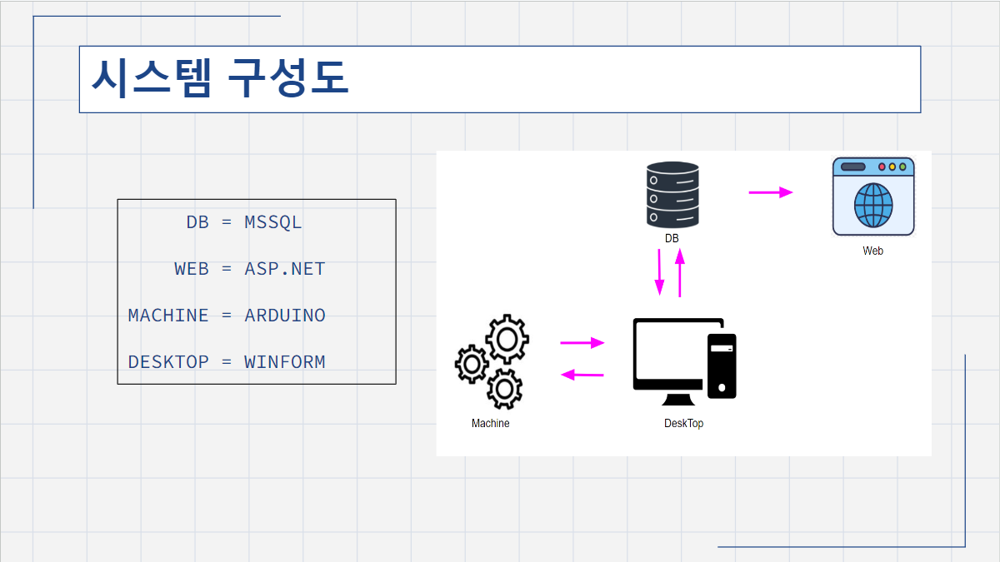
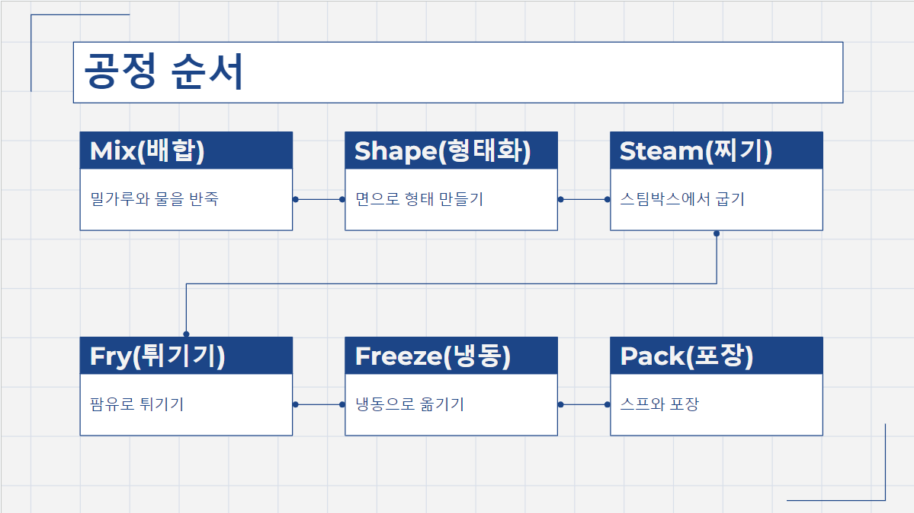
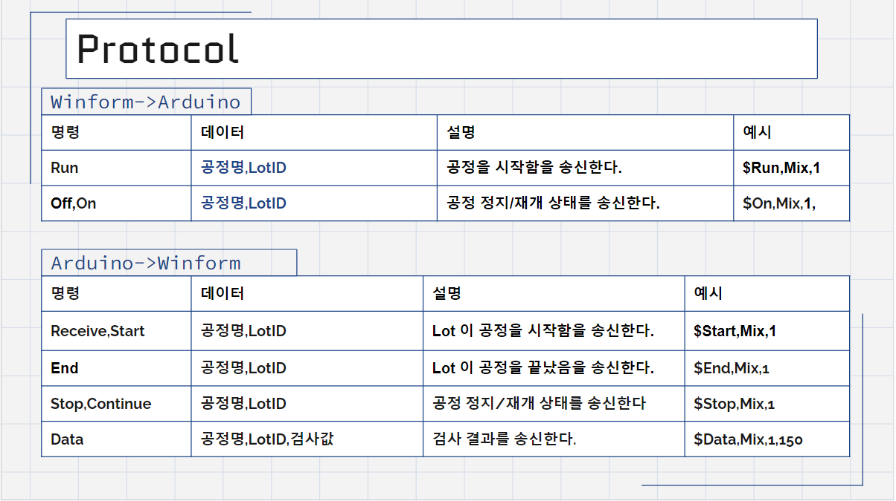

# **라면 공장 스마트팩토리 MES 프로그램**

## **개요**
-소프트웨어, 하드웨어 , 데이터베이스간 실시간 데이터 연동과 Serial 통신이 가능한 MES 시스템

## **개발 환경 및 활용 기술**
C#, ASP.NET, Winform, Arduino, Entity FrameWork

## **공헌한 내용**
- 기여도 40%
- 메뉴버튼으로 각 폼간 이동
- Serial Protocol 설계
- 공정을 통과한 LOT 이력 조회기능 구현
- H/W 와 S/W 간의 양방향 Serial 통신 구현
- 공정 상태 (정지/가동) 제어 버튼 기능 구현
- 센서를 이용한 LOT 검사 구현
- 온습도센서, 초음파센서, 수심 측정 센서, LED, 버튼 제어
- 공정이 시작되면 10초 타이머 실행, 공정이 멈추면 타이머 일시정지 기능 구현
- 불량 여부 판별
- Winform 차트를 이용하여 검사 결과 시각화
- 데이터베이스에 검사 결과, 공정 상태 저장
- ATMEGA 2560을 활용한 하드웨어 회로 설계

## **프로젝트 설명**

시스템 설계도

공정 

Serial Protocol

### **공정 구현에 사용된 입출력 장치**

|부품명|사용 개수|사용 목적|
|---|---|---
|DHT11 온습도센서|1| 스팀기의 온도 검사
|Water Level Sensor|1|팜유의 용량 검사
|HC-SR04 초음파 센서|2|입출고시 LOT 개수 검사
|I2C LCD|1|공정 현황 실시간 표시
|LED_RED 빨간색|6|공정 정지시 점등
|LED_GREEN 초록색|6|공정 대기시 점등
|LED_YELLOW 노란색|6|공정 진행시 점등

[제작 시연 영상]

[제작 시연 영상]: https://www.youtube.com/watch?v=EIa28L82daU&list=PLedGoSru794-VINQHqtNmjeTm0uuZJ1Ck&index=1&ab_channel=MasterCode
